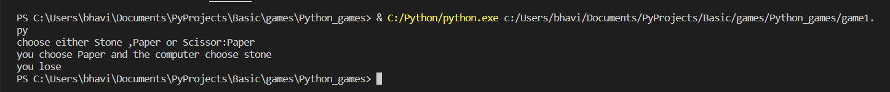
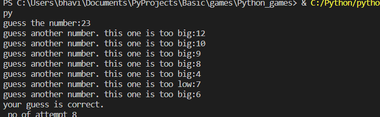

# Game 1(Stone paper scissor)

Game programming is a great way to learn how to program. You use many
tools that you’ll see in the real world, plus you get to play a game to
test your results! An ideal game to start your Python game programming
journey is [rock paper scissors](https://en.wikipedia.org/wiki/Rock_paper_scissors).

Output of game 1:

# Game 2 (Guess the number)

The number guessing game is a popular game among programmers. In the
number guessing game, the program selects a random number between two
numbers, and the user guesses the correct number. If you want to learn
how to create a guessing game using Python, this article is for you. In
this article, I will take you through a tutorial on creating a number
guessing game using the **[Python](https://thecleverprogrammer.com/2021/06/19/fundamentals-of-python/)** programming language.

Output of game 2:

